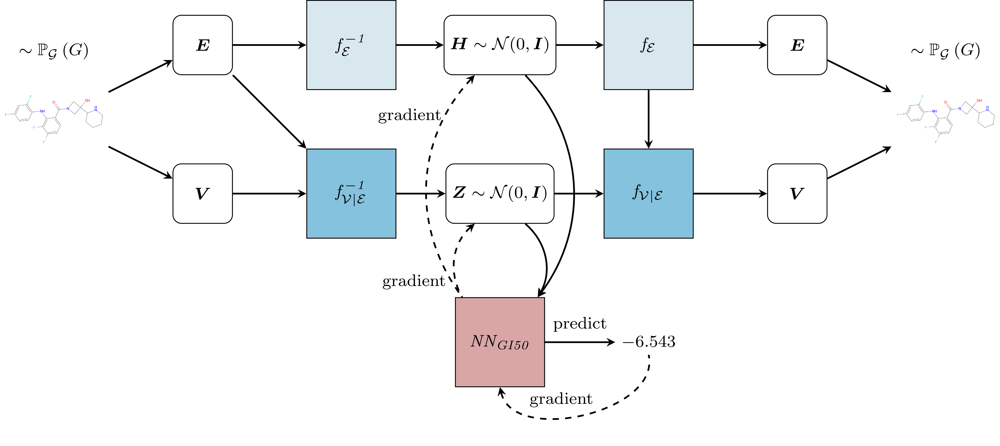
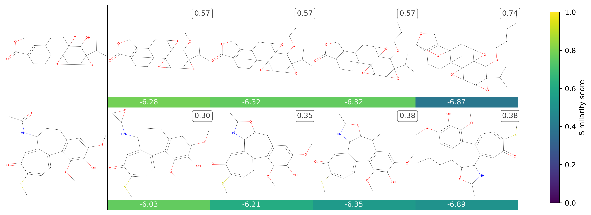
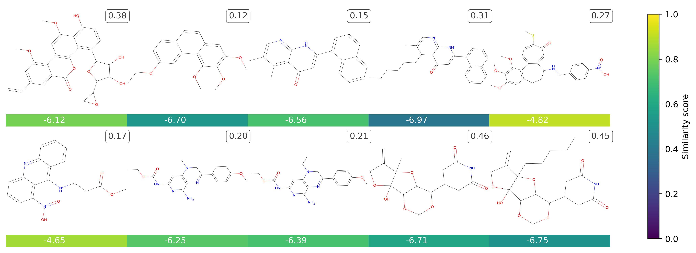
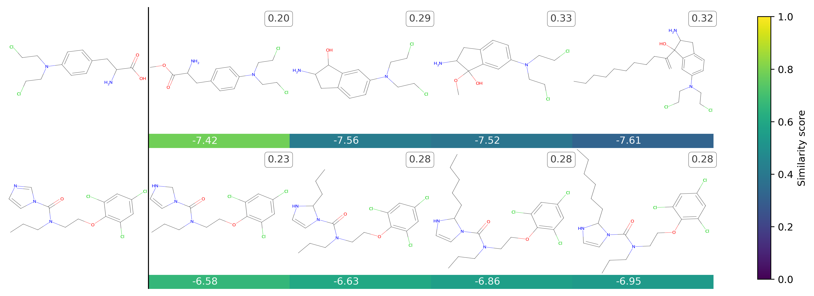

# TumFlow
This repository contains the code used to generate the results reported in the paper: [TODO](TODO).

## Overall Model



## Dependencies
This project uses the `conda` environment. In the `root` folder you can find the `.yml` file for the
configuration of the `conda` environment. Note that some versions of
the dependencies can generate problems in the configuration of the environment. For this reason, although
the `setup.bash` file is present to configure the project, it is better to configure it manually or with the `Dockerfile`.


## Structure
The project is structured as follows:
* `data`: contains the code to execute to preprocess the dataset with the NCI-60 cleaned dataset;
* `mflow`: contains the code about the model;
* `results`: contains the checkpoints and the results;


## Usage
### Data Download
First, you need to download the necessary files and configure the `conda` environment by running the following commands:
```bash
bash setup.bash install         # install env
bash setup.bash download        # download dataset
#bash setup.bash uninstall      # delete the conda env
conda activate tumflow          # activate conda env
```

### Data Pre-processing
To make de datasets type the following commands:
```bash
python tumflow.py preprocess --data_name melanoma_skmel28
```

### Model Training
To train the model, first use:
```bash
python tumflow.py train --data_name melanoma_skmel28  \
                        --batch_size  256  \
                        --max_epochs 300 \
                        --gpu 0  \
                        --debug False  \
                        --save_dir [EXP_FOLDER] \
                        --b_n_flow 7  \
                        --b_hidden_ch '128,128'  \
                        --a_n_flow 130 \
                        --a_hidden_gnn 128  \
                        --a_hidden_lin '128,128'  \
                        --mask_row_size_list 1 \
                        --mask_row_stride_list 1 \
                        --noise_scale 0.6 \
                        --b_conv_lu 2 \
                        --num_workers 32 \
                        --save_interval 50
```
Then:
```bash
python tumflow.py train_optimizer   -snapshot [BEST_EPOCH]  \
                                    --hyperparams_path tumflow-params.json \
                                    --batch_size 256 \
                                    --model_dir [EXP_FOLDER]   \
                                    --gpu 0 \
                                    --max_epochs 10  \
                                    --weight_decay 1e-3  \
                                    --data_name melanoma_skmel28  \
                                    --hidden 100,10  \
                                    --temperature 1.0  \
                                    --property_name AVERAGE_GI50 
```
where:
* `[BEST_EPOCH]` represents the model snapshot with the best results obtained in the first step, e.g., `model_snapshot_epoch_3.pt`:
* `[EXP_FOLDER]` indicates the folder to save the model results, e.g., `./results/melanoma_skmel28_v2_256`.


### Molecule Generation
#### Standard Molecule Generation
To generate new molecules:
```bash
python tumflow.py generate  --model_dir [EXP_FOLDER] \
                            -snapshot [BEST_EPOCH] \
                            --gpu 0 \
                            --data_name melanoma_skmel28 \
                            --hyperparams-path tumflow-params.json \
                            --batch-size 256 \
                            --temperature 0.85 \
                            --delta 0.1 \
                            --n_experiments 100 \
                            --save_fig false \
                            --correct_validity true
```

#### Structure Optimization
To optimize a molecule use the following command:
```bash
python tumflow.py optimize  -snapshot [BEST_EPOCH]  \
                            --hyperparams_path tumflow-params.json \
                            --batch_size 256 \
                            --model_dir [EXP_FOLDER]   \
                            --gpu 0   \
                            --data_name melanoma_skmel28   \
                            --property_name AVERAGE_GI50 \
                            --topk 150  \
                            --property_model_path [PROPERTY_PREDICTOR_BEST_EPOCH] \
                            --debug false  \
                            --topscore
```
where:
* `[PROPERTY_PREDICTOR_BEST_EPOCH]` represents the name of the property predictor, e.g., `model_predictor_snapshot_average_gi50.pt`

## Results
### Pre-trained Models
The pre-trained models, which should be placed in the folder `./results/`, can be downloaded at the following [link](https://drive.google.com/file/d/1t5bw-8moa-p5-mEe51sKv8i3DLshnKuR/view?usp=sharing).


### Generation from molecules in the NCI-60 dataset



### Generation from clinical molecules


## Docker
Once the repository is configured, you can use a Docker container to execute TumFlow.

### Standard Approach
First, you need to build the Docker:
```bash
docker build -t tumflow .
```

Then, you need to execute it:
```bash
docker run --gpus all -v ./:/TumFlow/ -it tumflow [COMMAND]
```
where `COMMAND` is the command to execute in the container.

Example:
```
docker run --gpus all -v ./:/TumFlow/ -it tumflow python tumflow.py     optimize  \
                                                                        -snapshot [BEST_EPOCH]  \
                                                                        --hyperparams_path tumflow-params.json \
                                                                        --batch_size 256 \
                                                                        --model_dir [EXP_FOLDER]   \
                                                                        --gpu 0   \
                                                                        --data_name melanoma_skmel28   \
                                                                        --property_name AVERAGE_GI50 \
                                                                        --topk 150  \
                                                                        --property_model_path [PROPERTY_PREDICTOR_BEST_EPOCH] \
                                                                        --debug false  \
                                                                        --topscore
```

### Docker-Compose Approach
First, you need to compose the service:
```bash
docker compose up
```

Then, you need to execute it:
```bash
docker compose run tumflow conda run --no-capture-output -n tumflow [COMMAND]
```
where `COMMAND` is the command to execute in the container.

Example:
```
docker compose run tumflow conda run --no-capture-output -n tumflow python tumflow.py   optimize  \
                                                                                        -snapshot [BEST_EPOCH]  \
                                                                                        --hyperparams_path tumflow-params.json \
                                                                                        --batch_size 256 \
                                                                                        --model_dir [EXP_FOLDER]   \
                                                                                        --gpu 0   \
                                                                                        --data_name melanoma_skmel28   \
                                                                                        --property_name AVERAGE_GI50 \
                                                                                        --topk 150  \
                                                                                        --property_model_path [PROPERTY_PREDICTOR_BEST_EPOCH] \
                                                                                        --debug false  \
                                                                                        --topscore
```


## Information
Our code is based on [moflow](https://github.com/calvin-zcx/moflow). Thanks!

## License
[Creative Commons Attribution-NonCommercial 4.0 International (CC-BY-NC-4.0)](https://github.com/drigoni/TumFlow/blob/main/LICENSE)
